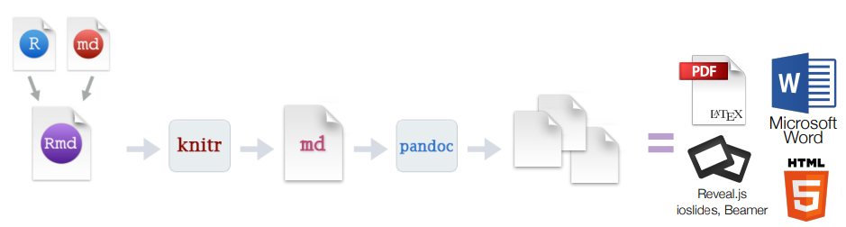
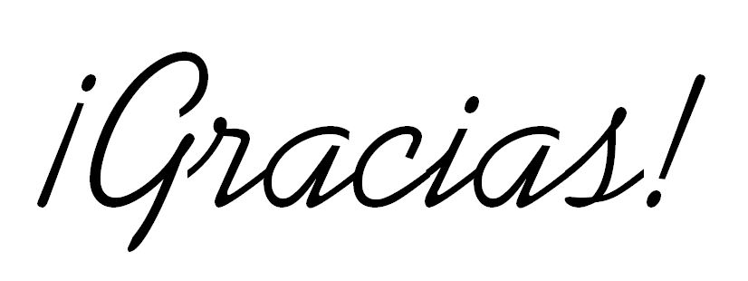

```{r setup, include=FALSE}
library(dplyr)
library(knitr)
library(kableExtra)
knitr::opts_chunk$set(echo = TRUE)
options(knitr.table.format="html")
```

## Introducción

Crear **reportes de campañas**, en los que se muestra un analisis de la campaña y unas conclusiones. 

Rmarkdown combina el **lenguaje markdown** con **chunks de código en R**. Esto se transforma un documento con un formato predetermiando como: *pdf*, presentaciones, *páginas web*, documentos de Word, dashboard...

## Librerías 

Para generar los pdf y html en Rmarkdown:

* ```rmarkdown```
* ```knitr```

Para nuestro reporte:

* ```kableExtra```
* ```ggplot2```
* ```dplyr```
* ```scales```

## Cómo funciona:

El paquete rmarkdown llama al paquete knitr que transforma el archivo **.Rmd** en un archivo .md, luego llama al paquete pandoc que es el que transforma el documento **.md** al documento en el formato final. 



```{r render, eval=FALSE}
rmarkdown::render("reporte.Rmd")
```

## Estructura
Los documentos .Rmd suelen tener los siguientes elementos:

* Header: *YAML*
* Texto: *formato markdown* (puede contener lenguaje html o latex)
* Código: *gráficas* y *tablas*


### Header
Es opcional, siempre va al **principio** del documento y se escribe entre `---`. 
En el se especifican diferentes opciones para el documento: `autor`, `title`, `date`...

```
---
date: '`r Sys.Date()`'
output: pdf_document
---
```

```{r output-options, echo=FALSE}
Opciones <- c('pdf', 'hmtl', 'word', 'presentaciones')
Instruccion <- c('pdf_document', 'html_document, html_notebook', 'word_document', 'beamer_presentation,  ioslides_presentation')
table <- data.frame(Opciones, Instruccion, stringsAsFactors=FALSE)

kable(table, format="html", caption="Outputs", col.names = c())%>%
  kable_styling(full_width = F)%>%
  column_spec(1, bold = T)
```

> PDF y español: ~~pdflatex~~ **xelatex**

```
---
date: '`r Sys.Date()`'
output: 
  pdf_document:
    latex_engine: xelatex
---
```

Podemos **parametrizar** el documento:

Incluir dentro del yaml los parametros que queremos con la key `parms`.

```
---
date: '`r Sys.Date()`'
output: 
  pdf_document:
    latex_engine: xelatex
params:
  id: 37810
  nombre: Coca Cola
  objetivo: clicks
---
```
Para acceder al valor de un paramétro, solo tenemos que escribir `params$` seguido del nombre del parámetro: 

* `params$id` -> 37810
* `params$nombre` -> "Coca Cola"
* `params$objetivo` -> "clicks"

Las opciones del header también pueden definirse con estos parámetros, para ello especificamos la opción, también separada por `---`, después de haber definido los parámetros:

```
---
date: '`r Sys.Date()`'
output: 
  pdf_document:
    latex_engine: xelatex
params:
  id: 37810
  nombre: Campaña Verano
  objetivo: clicks
---
---
title: ` r params$nombre `
---
```

```{r render_with_params, eval=FALSE}
rmarkdown::render("reporte.Rmd")
rmarkdown::render("reporte.Rmd", params=list('55500', 'Campaña de Invierno', 'impresiones'))
```


### Código
Se puede encontrar tanto **código en línea con el texto** como **chunks** de código.  
Los chunks se pueden customizar: 

```
knitr::opts_chunk$set(echo=FALSE, warning=FALSE)
```

```{r chunk-options, echo=FALSE}
Opciones <- c('echo', 'warning', 'cache', 'eval')
Descripcion <- c('mostrar/ocultar código', 'mostrar/ocultar mensajes de aviso', 'guardar en código en cache', 'evaluar o no el código dentro del chunk')
table <- data.frame(Opciones, Descripcion, stringsAsFactors=FALSE)

kable(table, format="html", caption="Opciones de los chunks", col.names = c())%>%
  kable_styling(full_width = F)%>%
  column_spec(1, bold = T)
```

#### Gráficos
Usamos gráficos sencillos con ggplot2.  

```{r graph-options, echo=FALSE}
OpcionesH <- c('fig_height', 'fig_width', 'fig_caption', 'fig_align')
OpcionesC <- c('fig.height', 'fig.width', 'fig.caption', 'fig.align')
Descripcion <- c('Tamaño de los gráficos (inches)', 'Tamaño de los gráficos (in)', 'Mostrar leyenda en los gráficos', 'Alinar la imagen (default, center, left, right)')
table <- data.frame(OpcionesH, OpcionesC, Descripcion, stringsAsFactors=FALSE)

kable(table, format="html", caption="Opciones de los gráficos", col.names = c('Header', 'Chunk', 'Descripción'))%>%
  kable_styling(full_width = F)%>%
  column_spec(c(1, 2), bold = T) %>%
  collapse_rows(columns = 2)
```

```
---
date: '`r Sys.Date()`'
output: 
  pdf_document:
    latex_engine: xelatex
    fig_height: 2
params:
  id: 37810
  nombre: Campaña Verano
  objetivo: clicks
---
---
title: ` r params$nombre `
---
```

#### Dataframes

- **Función**:

Para imprimir dataframes hay varias opciones, en los reportes en pdf usamos la función: `kable()`.

Se puede especificar directamente en el header con qué función se imprimirán todos los dataframe con **df_print**.
```
---
title: "Reporte de Campaña"
date: '`r Sys.Date()`'
output: 
  pdf_document:
    latex_engine: xelatex
    fig_height: 2
    df_print: kable
params:
  id: 37810
  nombre: Campaña Verano
  objetivo: clicks
---
```

- **Formato**:

El formato con el que se imprime el dataframe se especifica en la función kable() con el argumento *format*:  
`kable(dataframe, format="latex")`  
Si el formato es el mismo en todas las tablas, se puede especificar en un chunk al inicio del documento:
```
options(knitr.table.format = "latex") 
```

- **Estilo**:

Para las tablas del reporte usamos también el paquete **kableExtra**: permite customizar una tabla creada con kable(), y lo hace usando el pipe `%>%`.

```{r df, echo=FALSE}
dt <- mtcars[1:5, 1:4]
```

```{r print_df}
# Tabla en HTML con kable
kable(dt, format = "html")
```

```{r print_df1}
# Tabla en HTML con kable y features de kableExtra
kable(dt, format = "html") %>%
  kable_styling(bootstrap_options = "striped", full_width = F) %>%
  add_footnote(c("tabla con kableExtra en HTML"))
```

##### Diferencia entre HTML y PDF
Si el formato es *latex*: ~~bootstrap_options~~ `latex_options`
```
# Tabla en PDF
kable(df, format="latex")%>%
  kable_styling(latex_options = c("striped"))
```

## Dificultades

* El dataframe tiene muchas filas y no cabe en una sola página: 
    + kable(**longtable**=T) para especificar que es una tabla larga
    + kableExtra: repetir el header **repeat_header**
```
kable(df, longtable = T) %>%
  kable_styling(latex_options = c("repeat_header"))
```

* La tabla sale en otro lugar del documento: **hold_position**
```
kable(df) %>%
  kable_styling(latex_options = c("hold_position"))
```

* El texto en una celda es demasiado largo y al imprimir la tabla se corta por un lado: **column_spec**

```{r example_df, echo=FALSE}
df <- read.csv('example.csv', header=T, sep = ",")
```

```{r long_text}
kable(df)%>%
  kable_styling(full_width = F) %>%
  column_spec(2, width = "20em")
```

* Separador de miles: **format.args**
```{r numbers_df, echo=FALSE}
df <- read.csv('numbers.csv', header=T, sep = ",")
```

```{r thousands, echo=FALSE}
kable(df)%>%
    kable_styling(bootstrap_options = c("striped"), full_width = F)
```

```{r thousands_sep}
kable(df, format.args=list(big.mark = ','))%>%
    kable_styling(bootstrap_options = c("striped"), full_width = F)
```

* Encodings (€, ñ, acentos...): guardar en R con **encoding UTF-8**

*Save with Encoding...*
```{r encoding, echo=FALSE, out.width="400px"}
knitr::include_graphics("./images/encoding.png")
```

## Links e información útil

+ Intro a Rmarkdown: https://rmarkdown.rstudio.com/articles_intro.html
+ Rmarkdown cheatsheet: https://www.rstudio.com/wp-content/uploads/2016/03/rmarkdown-cheatsheet-2.0.pdf
+ Rmarkdown reference guide cheatseet: https://www.rstudio.com/wp-content/uploads/2015/03/rmarkdown-reference.pdf
+ Opciones para chunks: https://yihui.name/knitr/options/#plots
+ Rmarkdown con Rstudio: https://rmarkdown.rstudio.com/articles_integration.html
+ kableExtra en pdf: https://haozhu233.github.io/kableExtra/awesome_table_in_pdf.pdf
+ kableExtra en html: https://cran.r-project.org/web/packages/kableExtra/vignettes/awesome_table_in_html.html
+ Otros lenguajes en knitr: https://rmarkdown.rstudio.com/authoring_knitr_engines.html


